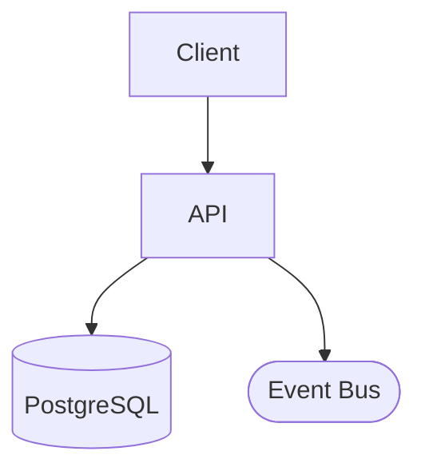
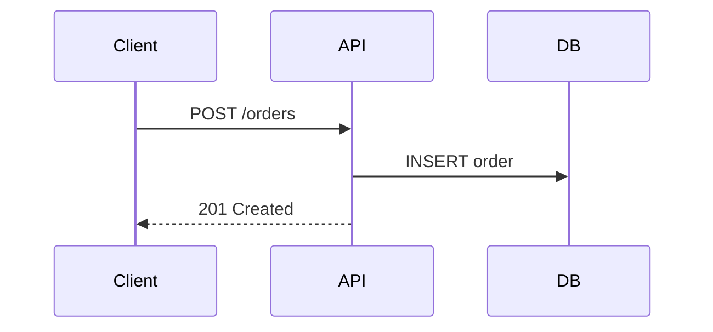
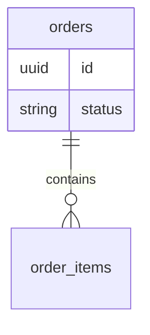

 
# 🏛️ Architect Skill — System Design & Technical Leadership
 
## Quick Reference
 
| Section | When to use |
|---------|-------------|
| [1. Tech Design Document](#1-tech-design-document-tdd) | New features, cross-service changes |
| [2. Architecture Decision Records](#2-architecture-decision-records-adr) | Technology or infrastructure choices |
| [3. System Design Review](#3-system-design-review) | Pre-implementation review checklist |
| [4. API Design Guidelines](#4-api-design-guidelines) | Designing or reviewing REST/async APIs |
| [5. Security & Threat Modeling](#5-security--threat-modeling) | New surfaces, sensitive data, auth flows |
| [6. Microservices & Event-Driven Patterns](#6-microservices--event-driven-patterns) | Distributed system decisions |
| [7. Tech Debt Management](#7-tech-debt-management) | Refactoring planning, debt classification |
| [8. Capacity Planning](#8-capacity-planning) | Scaling, SLOs, bottleneck analysis |
| [9. Diagram Standards](#9-diagram-standards) | Mermaid/Draw.io conventions |
 
---
 
## 1. Tech Design Document (TDD)
 
### When TDD is Required
- New feature spanning ≥2 services/layers
- Database schema changes affecting ≥3 tables
- New external integration (payment, auth, third-party API)
- Architecture-level refactoring
- Performance-critical features
 
### TDD Template
```markdown
# TDD: {Feature Name}
**Author**: {name}  |  **Date**: {date}  |  **Status**: Draft / In Review / Approved
 
## 1. Problem Statement
What problem are we solving? Why now? What metric will improve?
 
## 2. Proposed Design
 
### 2.1 System Architecture
[Diagram — Mermaid or ASCII]
 
### 2.2 API Contract
[Key endpoints — request/response]
 
### 2.3 Database Schema Changes
[New tables, modified columns, migrations]
 
### 2.4 Data Flow
[Sequence diagram — how data flows through the system]
 
## 3. Alternatives Considered
| Option | Pros | Cons | Why Not |
|--------|------|------|---------|
| Option A | ... | ... | ... |
| Option B | ... | ... | Selected |
 
## 4. Risk & Mitigation
| Risk | Impact | Probability | Mitigation |
|------|--------|:-----------:|-----------|
| ... | High | Medium | ... |
 
## 5. Rollout Plan
- Phase 1: ...
- Phase 2: ...
- Rollback plan: ...
 
## 6. Open Questions
- [ ] Question 1?
- [ ] Question 2?
```
 
### TDD Review Process
1. Author writes TDD
2. Review by ≥2 senior engineers (1 business day)
3. Address comments, update TDD
4. Approval → development can start
5. TDD archived in `/docs/tdd/`
 
---
 
## 2. Architecture Decision Records (ADR)
 
### When ADR is Required
- Technology choice (framework, library, service)
- Data storage decision (SQL vs NoSQL, cache strategy)
- Authentication/authorization approach
- API versioning strategy
- Infrastructure decisions (cloud provider, hosting)
 
### ADR Template
```markdown
# ADR-{number}: {Decision Title}
**Date**: {date}  |  **Status**: Proposed / Accepted / Deprecated / Superseded
 
## Context
What situation prompted this decision? What technical or business forces are at play?
 
## Decision
What is the change we're making?
 
## Consequences
### Positive
- ...
 
### Negative
- ...
 
### Neutral
- ...
 
## Alternatives Considered
1. **Option A**: [description] — rejected because [reason]
2. **Option B**: [description] — rejected because [reason]
```
 
### ADR Rules
- Stored in `/docs/adr/` directory
- Numbered sequentially: `ADR-001-use-uuid-v7.md`
- Never delete — mark as Deprecated or Superseded
- Reference related ADRs
 
---
 
## 3. System Design Review
 
### Review Checklist
- [ ] **Scalability**: Will this work at 10x current load?
- [ ] **Reliability**: What happens when component X fails?
- [ ] **Security**: What's the attack surface? (→ see Section 5)
- [ ] **Data integrity**: Can data be lost or corrupted?
- [ ] **Performance**: Any N+1 queries? Missing indexes?
- [ ] **Observability**: Can we debug issues in production?
- [ ] **Backward compatibility**: Does this break existing clients?
- [ ] **Migration path**: How do we get from current to target state?
 
### Design Principles
1. **KISS** — Keep It Simple, Stupid
2. **YAGNI** — You Aren't Gonna Need It (don't over-engineer)
3. **Separation of Concerns** — Clear boundaries between layers
4. **Fail Fast** — Detect and report errors early
5. **Idempotency** — Operations safe to retry
 
---
 
## 4. API Design Guidelines
 
### REST Conventions
- Use nouns for resources, verbs for actions: `GET /orders`, `POST /orders/{id}/cancel`
- Plural resource names: `/users`, `/sessions`, not `/user`
- HTTP status codes must be semantic:
  - `200 OK` — success with body
  - `201 Created` — resource created (include `Location` header)
  - `204 No Content` — success, no body
  - `400 Bad Request` — client validation error
  - `401 Unauthorized` — not authenticated
  - `403 Forbidden` — authenticated but not allowed
  - `404 Not Found` — resource doesn't exist
  - `409 Conflict` — state conflict (e.g., duplicate, lock held)
  - `422 Unprocessable Entity` — semantically invalid input
  - `429 Too Many Requests` — rate limit hit
 
### Request / Response Design
- Always version APIs: `/v1/`, `/v2/` prefix or `Accept: application/vnd.api+json;version=2`
- Use ISO 8601 for dates: `2025-03-27T10:00:00Z`
- Paginate list endpoints: `{ data: [...], meta: { total, page, per_page } }`
- Error envelope (consistent across all endpoints):
```json
{
  "error": {
    "code": "PAYMENT_LOCK_HELD",
    "message": "This session is currently locked for payment.",
    "details": {}
  }
}
```
 
### Async / Event APIs
- Prefer events for cross-service side effects (don't chain synchronous HTTP calls)
- Events must be: named in past tense (`OrderPlaced`, `PaymentConfirmed`), versioned, idempotent on replay
- Always include: `event_id`, `occurred_at`, `aggregate_id`, `version`
 
### API Review Checklist
- [ ] Are all endpoints authenticated/authorized appropriately?
- [ ] Is pagination present on all list endpoints?
- [ ] Are errors consistent and machine-readable?
- [ ] Are breaking changes behind a new version?
- [ ] Are long-running operations async with a polling/webhook pattern?
 
---
 
## 5. Security & Threat Modeling
 
### STRIDE Quick Reference
| Threat | Question to ask | Example mitigation |
|--------|----------------|-------------------|
| **S**poofing | Can an attacker impersonate a user or service? | Strong auth, mutual TLS |
| **T**ampering | Can data be modified in transit or at rest? | HTTPS, checksums, signed tokens |
| **R**epudiation | Can a user deny an action? | Audit logs, signed events |
| **I**nformation Disclosure | Can sensitive data leak? | Encryption, least-privilege |
| **D**enial of Service | Can the system be overwhelmed? | Rate limiting, circuit breakers |
| **E**levation of Privilege | Can a user gain higher permissions? | RBAC, input validation |
 
### Threat Modeling Process (lightweight)
1. **Draw the data flow** — map where sensitive data enters, rests, and exits
2. **Identify trust boundaries** — where does a request cross from one trust zone to another?
3. **Apply STRIDE** — one pass per component at each trust boundary
4. **Rate each threat** — Impact × Probability → High / Medium / Low
5. **Document mitigations** — for High and Medium threats, mitigation is required before launch
 
### Security Checklist (per feature)
- [ ] Authentication required on all non-public endpoints
- [ ] Authorization checked at the resource level (not just route level)
- [ ] User input validated and sanitized (SQL injection, XSS, path traversal)
- [ ] Sensitive fields never logged (passwords, tokens, card numbers, PII)
- [ ] Secrets in environment variables, not source code
- [ ] Dependencies checked for known CVEs (`npm audit`, `pip-audit`)
- [ ] Rate limiting on auth endpoints (login, OTP, password reset)
- [ ] HTTPS enforced; no mixed content
- [ ] Audit log for sensitive operations (payment, permission changes, data export)
 
---
 
## 6. Microservices & Event-Driven Patterns
 
### When to Split a Service
**Good reasons to split:**
- Independent scaling requirements (e.g., order processing vs. reporting)
- Independent deployment cadence (e.g., ML model updates vs. core API)
- Clear bounded context with its own data ownership
- Different failure tolerance (e.g., payments must never go down; analytics can lag)
 
**Bad reasons to split:**
- "It feels large" — size alone is not a reason
- "We might need it later" — YAGNI applies to microservices too
- Team pressure without a clear domain boundary
 
### Communication Patterns
| Pattern | Use when | Avoid when |
|---------|----------|------------|
| **Sync REST** | Simple request-response, user is waiting | Chaining 3+ services, long operations |
| **Async events** | Side effects, fan-out, eventual consistency OK | User needs immediate confirmation |
| **gRPC** | High-throughput internal comms, strong contracts | Public APIs, browser clients |
| **Saga (choreography)** | Distributed transactions, each service reacts | Simple two-service flows |
| **Saga (orchestration)** | Complex flows needing central coordination | Teams with low event bus maturity |
 
### Event-Driven Design Rules
- **Each service owns its data** — no shared database between services
- **Events are the contract** — schema changes require versioning
- **Outbox pattern** for reliable event publishing (write event to DB in same transaction, then publish)
- **Consumers must be idempotent** — same event may be delivered more than once
- **Dead letter queue** on every consumer — failed messages must not silently disappear
 
### Distributed System Checklist
- [ ] Is there a clear owner for each piece of data?
- [ ] Are all inter-service calls retried with exponential backoff?
- [ ] Is there a circuit breaker on downstream dependencies?
- [ ] Are consumers idempotent?
- [ ] Is there a DLQ and alerting on DLQ depth?
- [ ] Can the system handle a downstream service being down for 30 minutes?
 
---
 
## 7. Tech Debt Management
 
### Classification
| Type | Example | Impact |
|------|---------|--------|
| **Deliberate** | "We'll refactor this next sprint" | Tracked, planned |
| **Accidental** | Discovered during code review | Add to backlog |
| **Bit Rot** | Outdated dependencies, deprecated APIs | Monitor, schedule |
 
### Tech Debt Budget
- **20% of sprint capacity** reserved for tech debt
- Non-negotiable — engineering is a partner, not a factory
- Track tech debt items in Registry with `REFAC-xxxxx` IDs
- Prioritize: security debt > performance debt > code quality debt
 
### When to Raise the Alarm
- Tests are being skipped "because they're slow"
- Developers are afraid to change Area X
- Same bug keeps recurring
- Onboarding new devs takes > 30 days
- Build time > 15 minutes
 
---
 
## 8. Capacity Planning
 
### Assessment Framework
```
1. Current metrics: QPS, response time, DB connections, storage
2. Growth projection: Expected growth in 3/6/12 months
3. Bottleneck identification: What breaks first at 2x/5x/10x load?
4. Scaling strategy: Horizontal vs Vertical for each component
5. Cost projection: Infrastructure cost at projected scale
```
 
### Performance SLOs
| Metric | Target |
|--------|--------|
| API response (p50) | < 100ms |
| API response (p99) | < 500ms |
| Page load (LCP) | < 2.5s |
| Uptime | 99.9% (8.7h downtime/year) |
 
---
 
## 9. Diagram Standards
 
### Tools
- **Mermaid** for inline diagrams (in markdown, in TDDs, in ADRs)
- **Draw.io** for complex architecture diagrams shared with stakeholders
 
### Required Diagrams per TDD
1. **System Architecture** — High-level component diagram
2. **Sequence Diagram** — Key API flow
3. **ER Diagram** — Database schema changes (if any)
 
### Mermaid Cheat Sheet
````markdown

 

 

````
 