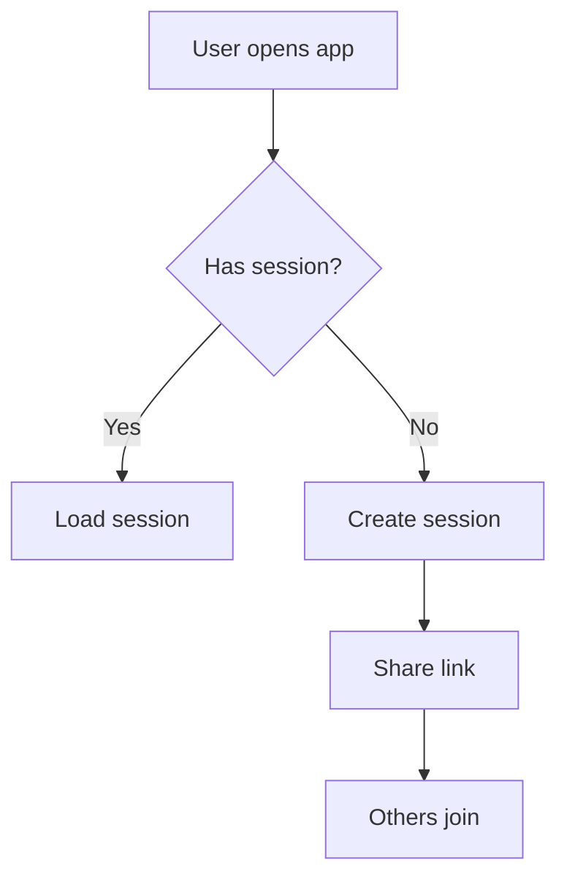

# 👔 BA Skill — Methodology & Deliverables

---

## 1. Spec Writing Methodology

### API Specification (`docs/api_spec.md`)
Mỗi endpoint được document theo format:

```markdown
### [METHOD] /api/v1/{resource}
- **Description**: What this endpoint does
- **Auth**: Required headers
- **Request Body**:
  ```json
  { "field": "type — description" }
  ```
- **Response 200**:
  ```json
  { "data": { ... }, "meta": { ... } }
  ```
- **Error Cases**:
  | Code | When |
  |------|------|
  | `VALIDATION_FAILED` | ... |
  | `RESOURCE_NOT_FOUND` | ... |
```

### Checklist khi viết spec
- [ ] Versioning rõ ràng (`/api/v1/...`)
- [ ] Request/Response format đồng nhất (JSON envelope)
- [ ] Error codes tuân thủ `rules/api-convention.md`
- [ ] Security headers được định nghĩa
- [ ] Pagination cho collection endpoints

---

## 2. Business Logic Documentation

### Format công thức
Mọi business rule phải viết dưới dạng:
```
INPUT:  [list of input variables]
RULE:   [formula or algorithm in plain text]
OUTPUT: [expected result with example]
EDGE:   [edge cases and how to handle]
```

### Rounding Strategy
- Quy định rõ: round ở đâu? (item level vs bill level)
- Residual handling: phần lẻ sau khi chia phân bổ cho ai?
- Document bằng ví dụ số cụ thể, dễ verify

---

## 3. Acceptance Criteria (AC)

### Gherkin Format (bắt buộc)
```gherkin
Feature: [Feature name]

  Scenario: [Scenario description]
    Given [initial state]
    When [action performed]
    Then [expected outcome]
    And [additional verification]
```

### AC Quality Checklist
- [ ] Mỗi scenario có Given/When/Then rõ ràng
- [ ] Cover positive path (happy path)
- [ ] Cover ít nhất 3 negative/boundary cases
- [ ] Boundary values được chỉ định cụ thể (min, max)
- [ ] AC map 1:1 với test cases mà Tester sẽ viết

---

## 4. User Flow Design

### Deliverable Format
- Text-based flow diagram hoặc Mermaid syntax
- Rõ ràng: Start → Decision points → End states
- Cover cả flow chính và flow lỗi (error flow)



---

## 5. Edge Case Analysis

### Framework "What If?"
Mỗi feature phải trả lời:
- **Concurrent**: 2+ users cùng thao tác thì sao?
- **Network**: Mất mạng giữa chừng thì sao?
- **State conflict**: Trạng thái bị đổi bởi người khác thì sao?
- **Data limit**: Dữ liệu quá lớn/nhỏ/trống thì sao?
- **Permission**: Người không có quyền thao tác thì sao?

---

## 6. Hand-Off Checklist

Trước khi bàn giao cho PM và Dev:
- [ ] `api_spec.md` đã cập nhật đầy đủ endpoints
- [ ] Business logic có ví dụ số cụ thể, verified bằng tay
- [ ] Ít nhất 3 edge cases đã có phương án xử lý
- [ ] Mọi yêu cầu đã có AC (Gherkin format)
- [ ] UI/UX descriptions đã tối ưu cho mobile-first
- [ ] Đã thông báo cho Dev về các thay đổi logic quan trọng
