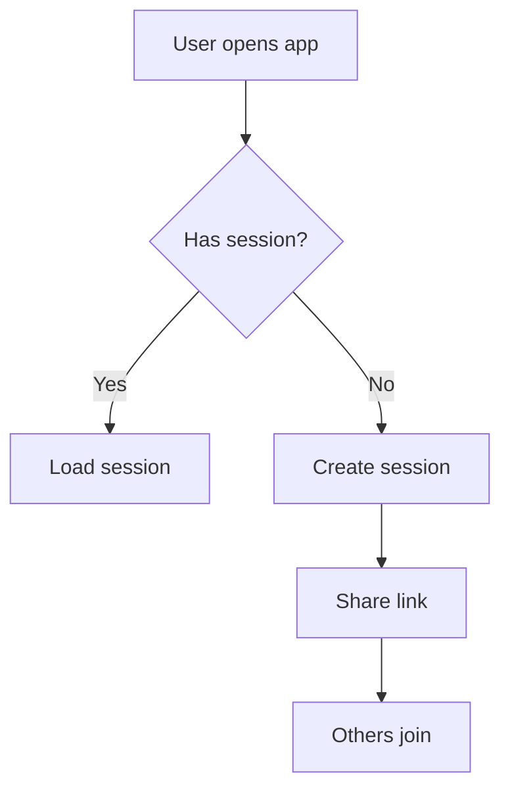

# 👔 BA Skill — Methodology & Deliverables

## Table of Contents
1. [API Specification](#1-api-specification)
2. [Business Logic Documentation](#2-business-logic-documentation)
3. [Acceptance Criteria (AC)](#3-acceptance-criteria-ac)
4. [User Flow Design](#4-user-flow-design)
5. [Edge Case Analysis](#5-edge-case-analysis)
6. [Sprint / Ticket Writing Standards](#6-sprint--ticket-writing-standards)
7. [Change Request & Impact Analysis](#7-change-request--impact-analysis)
8. [Hand-Off Checklist](#8-hand-off-checklist)

---

## 1. API Specification

### Structure Strategy
When `api_spec.md` grows beyond 300 lines, split it into modules:

```
docs/
├── api_spec.md                    # Index file — lists all modules
└── specs/
    └── api/
        ├── session.md
        ├── participant.md
        ├── order.md
        └── settlement.md
```

### Index File Format
```markdown
# API Specification — Index
| Module       | Endpoints                        | File                               |
|--------------|----------------------------------|------------------------------------|
| Session      | Create, Get, Update, Delete      | [session.md](specs/api/session.md) |
| Participant  | Join, Leave, Heartbeat           | [participant.md](specs/api/participant.md) |
| Order        | Add, Update, Delete, Batch       | [order.md](specs/api/order.md)     |
| Settlement   | Calculate, VietQR, Confirm       | [settlement.md](specs/api/settlement.md) |
```

### Module File Format
```markdown
# {Module Name} API
> Owner: BA | Last Updated: {date}
> Related Tasks: REQ-xxxxx, FEAT-xxxxx

## Endpoints

### [METHOD] /api/v1/{resource}
- **Description**: What this endpoint does
- **Auth**: Required headers
- **Request Body**:
  ```json
  { "field": "type — description" }
  ```
- **Response 200**:
  ```json
  { "data": { ... }, "meta": { ... } }
  ```
- **Error Cases**:
  | Code                  | When |
  |-----------------------|------|
  | `VALIDATION_FAILED`   | ...  |
  | `RESOURCE_NOT_FOUND`  | ...  |
```

### When to Split
| Trigger                   | Action                           |
|---------------------------|----------------------------------|
| `api_spec.md` > 300 lines | Start splitting first module     |
| > 5 resource domains      | One module file per domain       |
| Team > 3 devs             | Split to prevent merge conflicts |

### Spec Writing Checklist
- [ ] Clear versioning (`/api/v1/...`)
- [ ] Consistent request/response format (JSON envelope)
- [ ] Error codes follow `rules/api-convention.md`
- [ ] Security headers defined
- [ ] Pagination for collection endpoints
- [ ] If > 300 lines, already split into modules

---

## 2. Business Logic Documentation

### Rule Format
Every business rule must follow this structure:
```
INPUT:  [list of input variables]
RULE:   [formula or algorithm in plain text]
OUTPUT: [expected result with example]
EDGE:   [edge cases and how to handle]
```

### Rounding Strategy
- Specify clearly: where does rounding happen? (item level vs. bill level)
- Residual handling: who absorbs the remainder after splits?
- Always document with concrete numeric examples that can be verified by hand

---

## 3. Acceptance Criteria (AC)

### Gherkin Format (required)
```gherkin
Feature: [Feature name]

  Scenario: [Scenario description]
    Given [initial state]
    When  [action performed]
    Then  [expected outcome]
    And   [additional verification]
```

### AC Quality Checklist
- [ ] Each scenario has a clear Given / When / Then
- [ ] Happy path covered
- [ ] At least 3 negative / boundary cases covered
- [ ] Boundary values explicitly stated (min, max, zero, null)
- [ ] AC maps 1:1 to test cases the tester will write

---

## 4. User Flow Design

### Deliverable Format
- Text-based flow diagram or Mermaid syntax
- Clear: Start → Decision points → End states
- Must cover both happy path and error flows



---

## 5. Edge Case Analysis

### "What If?" Framework
Every feature must answer:
- **Concurrent**: What if 2+ users act simultaneously?
- **Network**: What if connection drops mid-action?
- **State conflict**: What if state was changed by someone else?
- **Data limit**: What if data is too large / too small / empty?
- **Permission**: What if an unauthorized user attempts the action?

---

## 6. Sprint / Ticket Writing Standards

### Ticket Types & When to Use
| Type       | Use When                                          |
|------------|---------------------------------------------------|
| **Story**  | Delivering user-visible value                     |
| **Task**   | Internal/technical work with no direct user value |
| **Bug**    | Something broken vs. defined behavior             |
| **Spike**  | Research or investigation with a time-box         |

### User Story Format
```
As a [role],
I want to [action],
So that [benefit / value].
```

### Ticket Template
```markdown
## Summary
[One-line description of what needs to be done]

## Context
[Why this ticket exists. Link to related spec, PRD, or requirement.]

## Acceptance Criteria
- [ ] Given / When / Then (use Gherkin format from Section 3)

## Out of Scope
[Explicitly state what is NOT included to prevent scope creep]

## Dependencies
- Blocked by: [ticket IDs]
- Blocks: [ticket IDs]

## Notes for Dev
[Implementation hints, gotchas, or constraints the BA is aware of]
```

### Ticket Writing Checklist
- [ ] Title is action-oriented (starts with a verb)
- [ ] Acceptance criteria are testable and unambiguous
- [ ] Out-of-scope section explicitly defined
- [ ] Dependencies linked
- [ ] Story points / estimate discussed with dev before finalizing

---

## 7. Change Request & Impact Analysis

### When to Raise a Change Request (CR)
- Scope changes after sign-off
- New requirements discovered mid-sprint
- Business rule changes that affect existing behavior
- Any API contract change that breaks consumers

### CR Template
```markdown
## Change Request: [CR-ID] — [Short title]
> Raised by: [Name] | Date: {date} | Status: [Draft / Under Review / Approved / Rejected]

## What Changed
[Clear description — before vs. after]

## Reason / Business Justification
[Why is this change needed now?]

## Impact Analysis

### Affected Areas
| Area             | Impact Level (High/Med/Low) | Details |
|------------------|-----------------------------|---------|
| API Endpoints    |                             |         |
| Database Schema  |                             |         |
| Frontend UI      |                             |         |
| Business Logic   |                             |         |
| Existing Tests   |                             |         |

### Effort Estimate
| Team      | Estimated Effort | Notes |
|-----------|-----------------|-------|
| Backend   |                 |       |
| Frontend  |                 |       |
| QA        |                 |       |

## Risks
[What could go wrong if this change is implemented? What if it isn't?]

## Decision
[ ] Approved — implement in sprint: ___
[ ] Rejected — reason: ___
[ ] Deferred — revisit: ___
```

### Impact Analysis Checklist
- [ ] All affected areas identified (API, DB, UI, logic, tests)
- [ ] Effort estimated with dev team input
- [ ] Risks documented
- [ ] Stakeholders notified before decision
- [ ] Related tickets updated or created after approval

---

## 8. Hand-Off Checklist

Before handing off to PM and Dev:
- [ ] `api_spec.md` fully updated with all endpoints
- [ ] Business logic has concrete numeric examples, verified manually
- [ ] At least 3 edge cases have documented handling plans
- [ ] All requirements have AC in Gherkin format
- [ ] UI/UX descriptions optimized for mobile-first
- [ ] Sprint tickets written and reviewed with the dev team
- [ ] Any change requests documented with full impact analysis
- [ ] Dev team notified of all significant logic changes